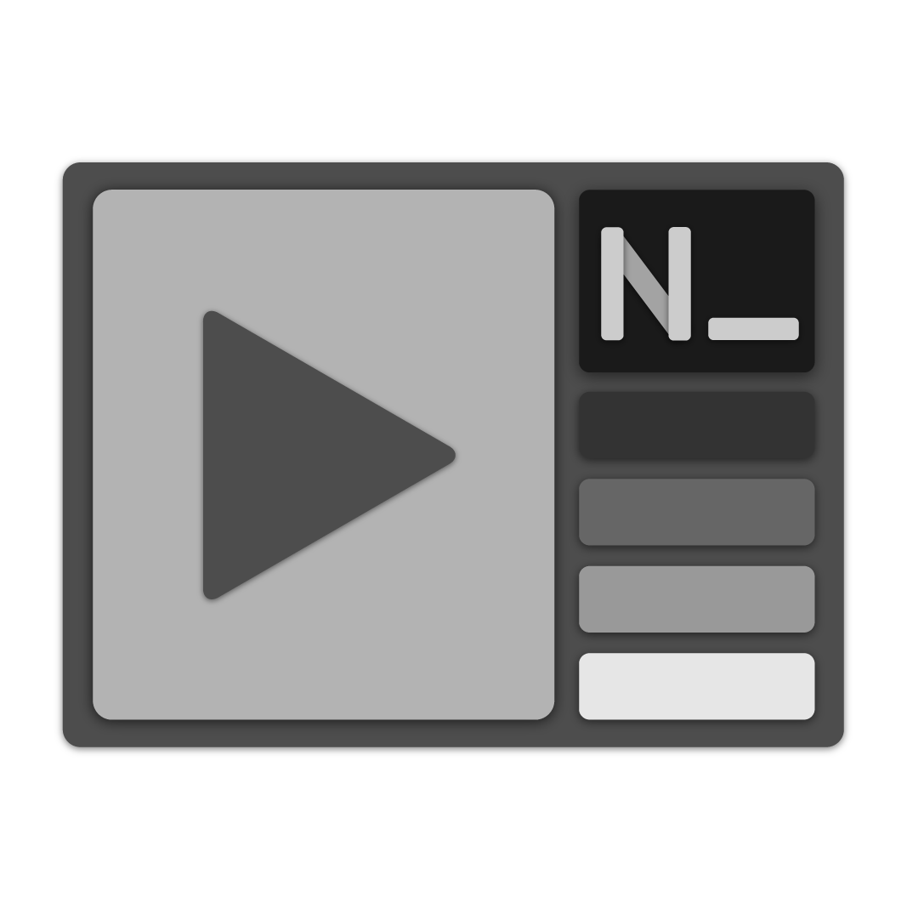

# VideoNotes

为边看视频边记录笔记的人群设计的基于网页的应用。

A web-based application created for those who take notes while watching video.


📥 [从 GitHub Release 下载最新版（推荐，Windows） \| Download with GitHub Release](https://github.com/smallg0at/VideoNotes/releases)

🌐 [使用最新的在线版本 \| Use Current Online (Standalone) Edition](https://smallg0at.github.io/VideoNotes/VideoNotes.html)

## Features

- Videos
  - supports opening from local
  - support online streaming:
    - bilibili
    - acfun
    - Microsoft Stream
    - Youtube
- Support .pdf, .html opening as well as websites that allow iframe.
- Simplistic Design
- Non-distractive notes display
- nw.js support

## Deployment

### Browser

simply open `VideoNotes.html` in any browser or serve on a server.

Internet Explorer is supported, but its scripts should be compiled from main.mjs with `npm run babel` first.

### node.js (nw.js)

```
npm install
npm start
```

## Build

```
npm run dist
```
